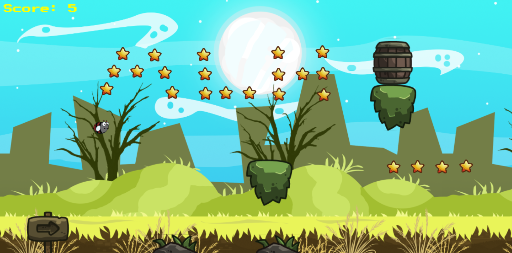

[]
[]
[](./LICENSE.md)

# FlappyBug

**FlappyBug** is Multiplayer version of the classic FlappyBird Game. Though inspired by the FlappyBird game, FlappyBug has got a magnificent interface, where the player collects the assets and on collision, it dies. Players can play alone or with any other random player. In the multiplayer version, the one who collects maximum assets win the game.

### Features

- A smooth background music that motivates to fly more and capture more stars.
- Balancing breathtaking visuals and charming aesthetic features with seamless navigation.
- A landing page with how to play and team description.



### Tech Stack

- Phaser.js (JS Framework for Game Development)
- HTML,CSS
- Socket.io with Nodejs for the multiplayer connection.
- Heroku for Deployment


# Contribution:

We're open to contributions!

## Test Locally

- Clone the repository and checkout to the directory by running:

```sh
$ git clone https://github.com/amalaabraham/flappybug

$ cd flappybug
```

Make sure you have `npm` and `node` installed.

- Install the dependencies by running:

```sh
$ npm install
```

- Start the local server:

```sh
$ npm start
```
