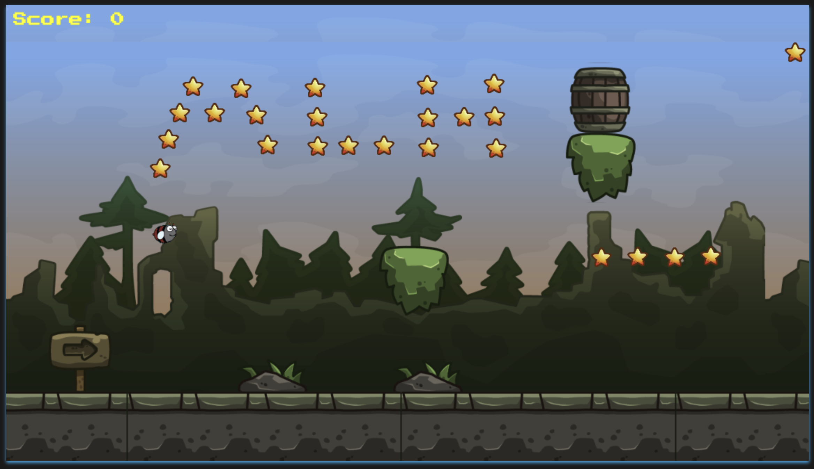

[]
[]
# FlappyBug
FlappyBug is Geeky Multiplayer version of the classic FlappyBird Game.

# Contribution:
We're open to contributions!
## Test Locally
- Clone the repository and checkout to the directory by running:
```sh
$ git clone https://github.com/amalaabraham/flappybug

$ cd flappybug
```
Make sure you have `npm` and `node` installed.
- Install the dependencies by running:

```sh
$ npm install
```

- Start the local server:
```sh
$ npm start
```
